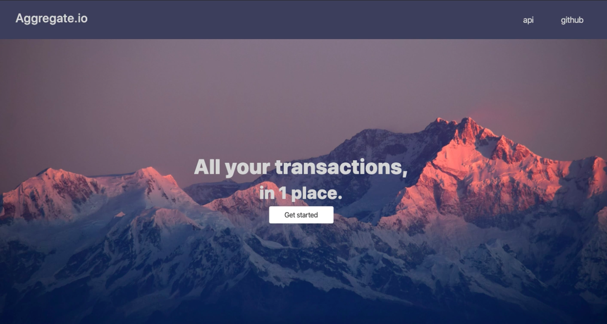
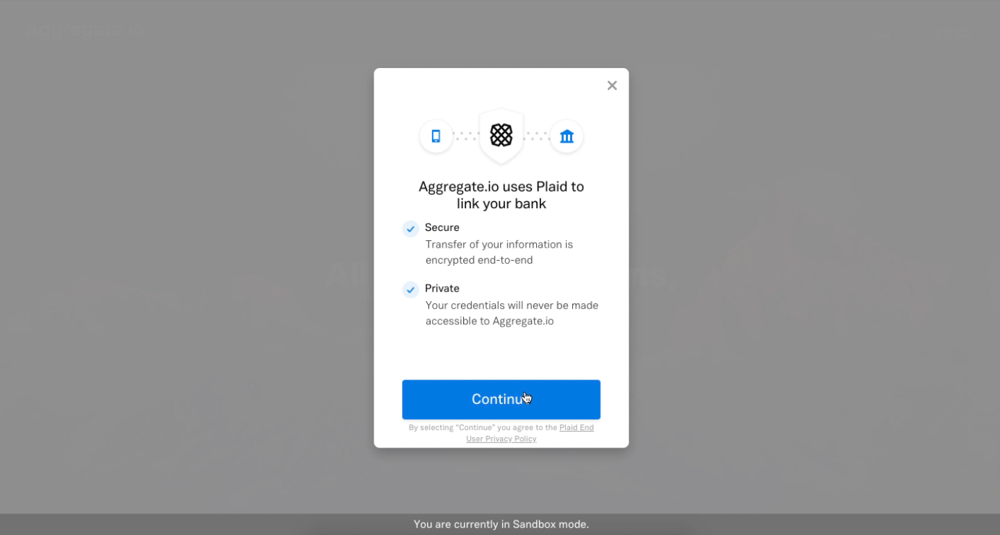
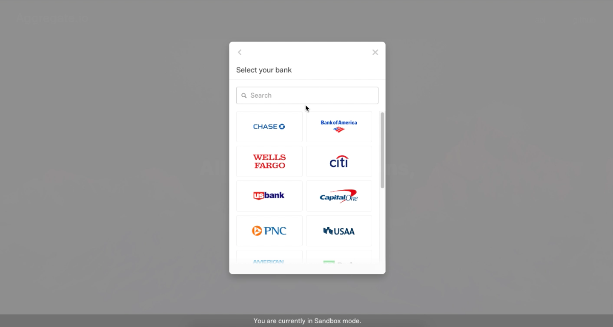
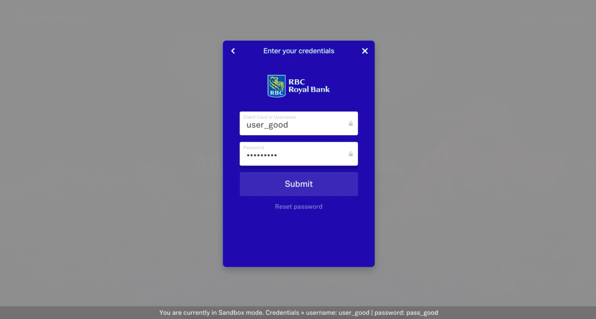
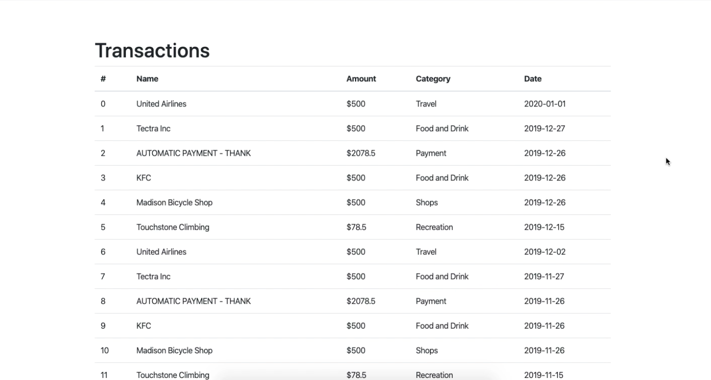

# View all your credit transactions using the Plaid API #
API - https://plaid.com/

### Steps to get the project working locally ###
1. Clone to repo
2. `pip install requirements.txt`
3. `npm install`
4. Create an account with Plaid and get an API key - https://dashboard.plaid.com/signin
5. Create a `config.py` file in the root directory with the following: 
    PLAID_CLIENT_ID = YOUR_CLIENT_ID  
    PLAID_SECRET = YOUR_SECRET_KEY  
    PLAID_PUBLIC_KEY = YOUR_PUBLIC_KEY  
    PLAID_ENV = 'sandbox'  
    PLAID_PRODUCTS = 'transactions'  
    PLAID_COUNTRY_CODES = 'US,CA,GB,FR,ES'  
6. Run `npm start` and `python server.py` and go to `localhost:3000`

### App screenshots ###

### What I learned ###
- Using the Plaid API to access a user's transactions
- Sending requests to a Flask backend from a React frontend
- Flask CORS
